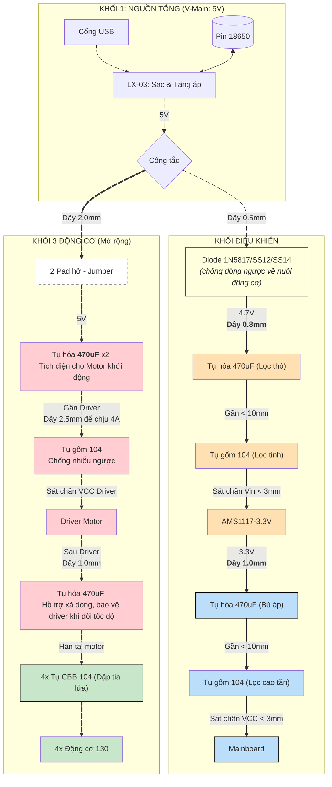

# THIẾT KẾ MODULE NGUỒN

## CÔNG SUẤT: Pin --> tăng áp 5V với LB-03 --> hạ áp cho điều khiển

Cơ bản: Dùng LX-03 (tăng áp lên 5V) rồi qua AMS1117-3.3 là phương án:
### Ưu điểm: 
- rất ổn định điện áp với 3v3 chuẩn, vi điều khiển không chết, không sập.
- Chống nhiễu tốt
### Nhược điểm
- Pin khai thác được khi >=3v4
- Hao phí điện năng

## Pin --> hạ áp bằng diot Schottky 

Cơ bản: Dùng trực tiếp pin lithium rồi hạ áp bằng diot SS12/SS14
### Ưu điểm: 
- Giá rẻ
- Ít tổn hao pin
### Nhược điểm
- Pin khai thác được khi >=3v5 
- Nhiễu lớn hơn

## TIẾT KIỆM: Pin --> tăng áp 5V với LB-03 --> hạ áp cho điều khiển
